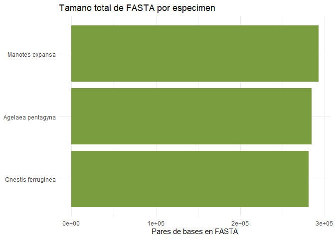
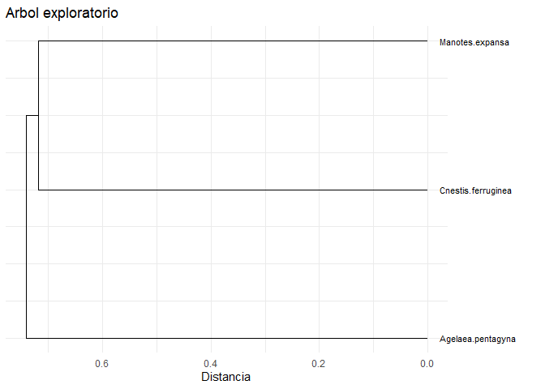
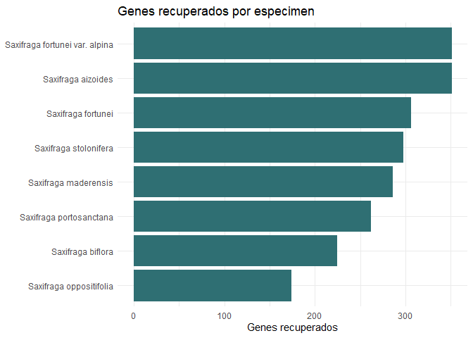

# rtreeoflife

`rtreeoflife` provides programmatic access to species records and
selected FASTA files associated with the Royal Botanic Gardens, Kew Tree
of Life Explorer. The package is designed for selective access: users
search or match species first, then download only the FASTA files needed
for an analysis.

The package includes `tol_species`, a normalized species/specimen index
derived from the Tree of Life species list. This makes common searches
available without mirroring the full Kew release locally.

## Installation

Install the released version from CRAN with:

``` r

install.packages("rtreeoflife")
```

Install the development version from GitHub with:

``` r

pak::pak("PaulESantos/rtreeoflife")
```

## Data Access Model

Kew release files are hosted at:

``` r

library(rtreeoflife)
#> ── Attaching rtreeoflife ────────────────────────────────── rtreeoflife 0.1.0 ──
#> ✔ species index       tol_species_index(), tol_match_species()
#> ✔ selective download  tol_download_fasta(), tol_export_fasta()
#> ✔ tidy FASTA          tol_attach_fasta(), tol_fasta_long()
#> ✔ visualisation       tol_plot_gene_recovery(), tol_plot_tree()
#> ℹ Data source: <https://treeoflife.kew.org/> and <https://sftp.kew.org/pub/treeoflife/current_release/>
tol_release_url()
#> [1] "https://sftp.kew.org/pub/treeoflife/current_release/"
```

The full release contains manifests, tree files, rendered tree assets,
and many FASTA files. Downloading the complete repository can be slow
and storage intensive, so the recommended workflow is:

1.  Search or match species in the bundled index.
2.  Resolve FASTA URLs for the selected records.
3.  Download to a temporary session directory.
4.  Manipulate the parsed FASTA data as tidy list-columns.
5.  Export FASTA files permanently only when needed.

## Example

This example searches three species, downloads only the available FASTA
files, summarises the recovered sequences, visualises the result with
`ggplot2`, builds an exploratory tree for one shared gene, and exports
FASTA files when the user decides to keep them.

``` r

library(dplyr)
#> 
#> Adjuntando el paquete: 'dplyr'
#> The following objects are masked from 'package:stats':
#> 
#>     filter, lag
#> The following objects are masked from 'package:base':
#> 
#>     intersect, setdiff, setequal, union
library(ggplot2)

targets <- c(
  "Cnestis ferruginea",
  "Agelaea pentagyna",
  "Manotes expansa"
)

# Search the bundled species index.
matches <- tol_match_species(
  targets,
  multiple = "best"
)

matches |>
  select(
    requested_name,
    matched_name,
    match_type,
    has_data,
    sequence_id,
    no_of_genes_recovered,
    fasta_file_url
  )
#> # A tibble: 3 × 7
#>   requested_name     matched_name       match_type has_data sequence_id
#>   <chr>              <chr>              <chr>      <lgl>          <int>
#> 1 Cnestis ferruginea Cnestis ferruginea exact      TRUE            5320
#> 2 Agelaea pentagyna  Agelaea pentagyna  exact      TRUE            5323
#> 3 Manotes expansa    Manotes expansa    exact      TRUE            5325
#> # ℹ 2 more variables: no_of_genes_recovered <int>, fasta_file_url <chr>

# Keep only records with FASTA availability.
selected <- matches |>
  filter(has_data)

# Download selected FASTA files to a temporary directory.
# Increase timeout/retries for slow network connections.
download_plan <- tol_download_fasta(
  selected,
  timeout = 1200,
  retries = 5
)
#> Descargando Cnestis ferruginea: INSDC.ERR5034759.Cnestis_ferruginea.a353.fasta
#> Descargando Agelaea pentagyna: INSDC.ERR5033663.Agelaea_pentagyna.a353.fasta
#> Descargando Manotes expansa: INSDC.ERR5034760.Manotes_expansa.a353.fasta

# Parse FASTA files into a tidy list-column.
plan_nested <- download_plan |>
  tol_attach_fasta()

# Convert nested FASTA records to long tidy data.
fasta_long <- plan_nested |>
  tol_fasta_long()

fasta_long |>
  select(sequence_id, scientific_name, gene_id, width)
#> # A tibble: 1,046 × 4
#>    sequence_id scientific_name    gene_id width
#>          <int> <chr>              <chr>   <int>
#>  1        5320 Cnestis ferruginea 4471     1122
#>  2        5320 Cnestis ferruginea 4527     1287
#>  3        5320 Cnestis ferruginea 4691      471
#>  4        5320 Cnestis ferruginea 4724      678
#>  5        5320 Cnestis ferruginea 4744      489
#>  6        5320 Cnestis ferruginea 4757      579
#>  7        5320 Cnestis ferruginea 4793     1833
#>  8        5320 Cnestis ferruginea 4796      870
#>  9        5320 Cnestis ferruginea 4802      963
#> 10        5320 Cnestis ferruginea 4806      612
#> # ℹ 1,036 more rows

# Summarise and plot recovered FASTA content.
fasta_summary <- plan_nested |>
  tol_fasta_summary()

tol_plot_fasta_summary(fasta_summary)
```



``` r


# Identify shared genes and build an exploratory tree.
common_genes <- plan_nested |>
  tol_common_genes(min_records = 2)

tree_result <- plan_nested |>
  tol_build_gene_tree(
    gene_id = common_genes$gene_id[[1]],
    min_records = 2
  )

tol_plot_tree(tree_result)
```



``` r


# Export FASTA files permanently only if they should be retained.
exported <- download_plan |>
  tol_export_fasta(
    dest_dir = "raw-data/fasta/by_recovery",
    manifest_path = "raw-data/fasta/fasta_export_manifest.csv",
    overwrite = FALSE
  )

exported |>
  select(scientific_name, local_path, export_status)
#> # A tibble: 3 × 3
#>   scientific_name    local_path                                    export_status
#>   <chr>              <chr>                                         <chr>        
#> 1 Cnestis ferruginea D:/rtreeoflife/raw-data/fasta/by_recovery/IN… ok           
#> 2 Agelaea pentagyna  D:/rtreeoflife/raw-data/fasta/by_recovery/IN… ok           
#> 3 Manotes expansa    D:/rtreeoflife/raw-data/fasta/by_recovery/IN… ok
```

## Species Search

Use exact taxonomic filters when the target group is known:

``` r

saxifraga <- tol_search_species(
  genus = "Saxifraga"
)

tol_plot_gene_recovery(saxifraga)
```



Use
[`tol_match_species()`](https://PaulESantos.github.io/rtreeoflife/reference/tol_match_species.md)
when starting from a vector of scientific names:

``` r

tol_match_species(
  c("Cnestis ferruginea", "Agelaea pentagyna", "Manotes expansa"),
  multiple = "best"
)
#> # A tibble: 3 × 22
#>   requested_name   request_order matched_name match_type match_distance has_data
#>   <chr>                    <int> <chr>        <chr>               <int> <lgl>   
#> 1 Cnestis ferrugi…             1 Cnestis fer… exact                   0 TRUE    
#> 2 Agelaea pentagy…             2 Agelaea pen… exact                   0 TRUE    
#> 3 Manotes expansa              3 Manotes exp… exact                   0 TRUE    
#> # ℹ 16 more variables: sequence_id <int>, data_source <chr>, order <chr>,
#> #   family <chr>, genus <chr>, specific_epithet <chr>,
#> #   specimen_reference <chr>, specimen_barcode <chr>, collection_date <int>,
#> #   country_of_origin <chr>, material_sampled <chr>,
#> #   no_of_genes_recovered <int>, no_of_bp_recovered <int>,
#> #   fasta_file_url <chr>, scientific_name <chr>, fasta_file_name <chr>
```

## Persistent Downloads

By default,
[`tol_download_fasta()`](https://PaulESantos.github.io/rtreeoflife/reference/tol_download_fasta.md)
stores files in a temporary session directory. This keeps exploratory
workflows lightweight:

``` r

plan <- tol_download_fasta(
  genus = "Saxifraga",
  specific_epithet = "fortunei"
)
#> Descargando Saxifraga fortunei: INSDC.ERR5006173.Saxifraga_fortunei.a353.fasta

plan |>
  tol_attach_fasta()
#> # A tibble: 1 × 11
#>   sequence_id scientific_name order family genus specific_epithet fasta_file_url
#>         <int> <chr>           <chr> <chr>  <chr> <chr>            <chr>         
#> 1         224 Saxifraga fort… Saxi… Saxif… Saxi… fortunei         https://sftp.…
#> # ℹ 4 more variables: fasta_file_name <chr>, local_path <chr>, status <chr>,
#> #   fasta <list>
```

To keep files permanently, use
[`tol_export_fasta()`](https://PaulESantos.github.io/rtreeoflife/reference/tol_export_fasta.md):

``` r

plan |>
  tol_export_fasta(
    dest_dir = "raw-data/fasta/by_recovery"
  )
```

## Release Utilities

Lower level helpers are available for metadata and small scoped
downloads:

``` r

tol_known_bundles()
#>                 bundle                                                    path
#> 1            manifests                                   sequence_manifest.txt
#> 2            manifests                                   deleted_sequences.txt
#> 3            manifests                                   specimen_manifest.txt
#> 4            manifests                       revised_specimen_nomenclature.txt
#> 5            manifests                                       gene_manifest.txt
#> 6         species_tree                    tree/species/treeoflife.current.tree
#> 7 species_tree_support tree/species/treeoflife.all_support_values.current.tree

manifest_files <- tol_download_bundle("manifests")

species_tree <- tol_download_bundle("species_tree")

sequence_manifest <- tol_manifest(manifest_files[[1]])
```

For ordinary FASTA access, prefer the species-index workflow above
instead of downloading complete release directories.

## Citation

To cite the package and the original Kew Tree of Life Explorer data
source, use:

``` r

citation("rtreeoflife")
#> To cite rtreeoflife and associated Kew Tree of Life Explorer data,
#> please use:
#> 
#>   Santos Andrade, P. E. (2026). rtreeoflife: Access Kew Tree of Life
#>   Data Releases. R package version 0.1.0.
#>   https://github.com/PaulESantos/rtreeoflife
#> 
#> The species records, FASTA files, and trees accessed by this package
#> are provided by the Royal Botanic Gardens, Kew Tree of Life Explorer.
#> When using Kew Tree of Life Explorer data, cite the original
#> publication and indicate the data release used.
#> 
#> To cite the original Kew Tree of Life Explorer data and trees, please
#> use:
#> 
#>   Baker, W. J., Bailey, P., Barber, V., Barker, A., Bellot, S., Bishop,
#>   D., Botigue, L. R., Brewer, G., Carruthers, T., Clarkson, J. J.,
#>   Cook, J., Cowan, R. S., Dodsworth, S., Epitawalage, N., Francoso, E.,
#>   Gallego, B., Johnson, M., Kim, J. T., Leempoel, K., Maurin, O.,
#>   McGinnie, C., Pokorny, L., Roy, S., Stone, M., Toledo, E., Wickett,
#>   N. J., Zuntini, A. R., Eiserhardt, W. L., Kersey, P. J., Leitch, I.
#>   J., and Forest, F. (2022). A Comprehensive Phylogenomic Platform for
#>   Exploring the Angiosperm Tree of Life. Systematic Biology, 71,
#>   301-319. doi:10.1093/sysbio/syab035
#> 
#> To see these entries in BibTeX format, use 'print(<citation>,
#> bibtex=TRUE)', 'toBibtex(.)', or set
#> 'options(citation.bibtex.max=999)'.
```

When using Kew Tree of Life Explorer data, cite the original publication
and indicate the data release used in the analysis.
